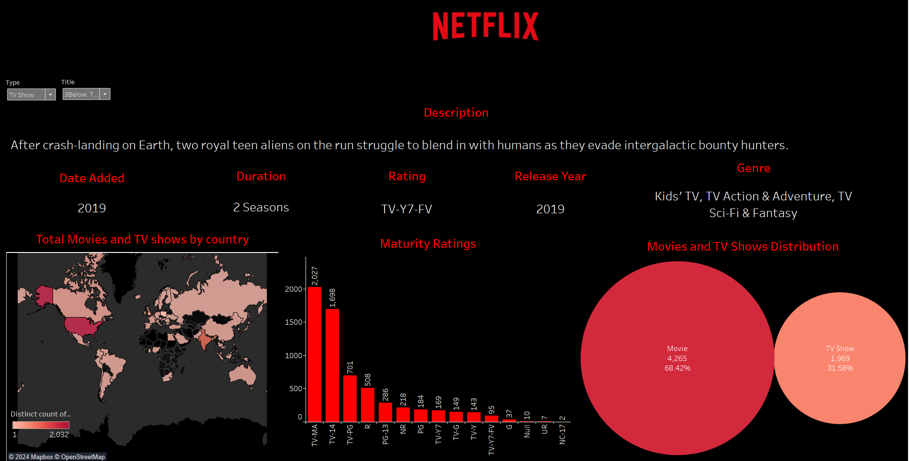
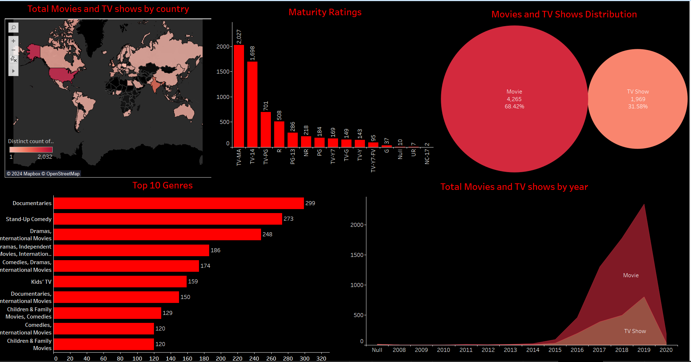
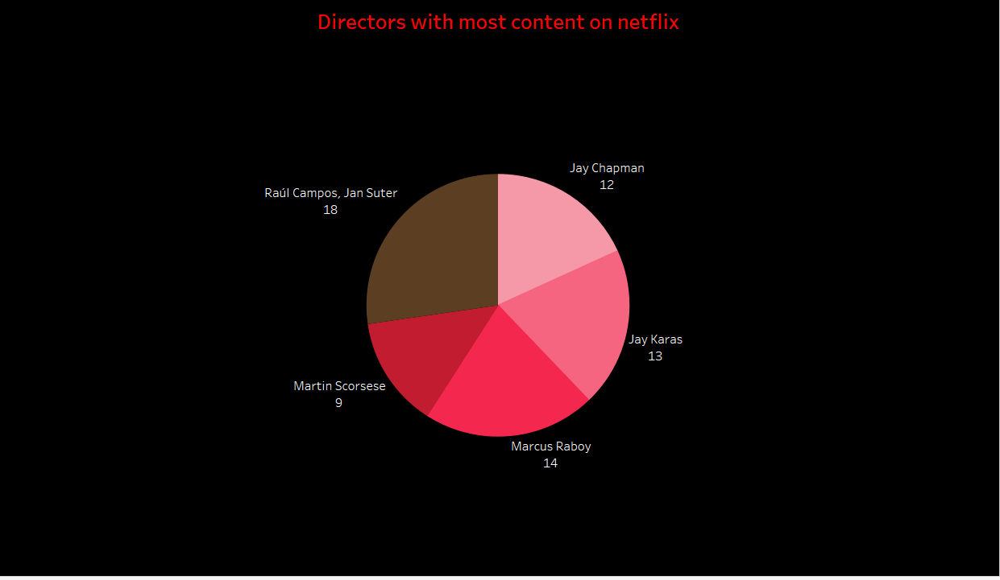
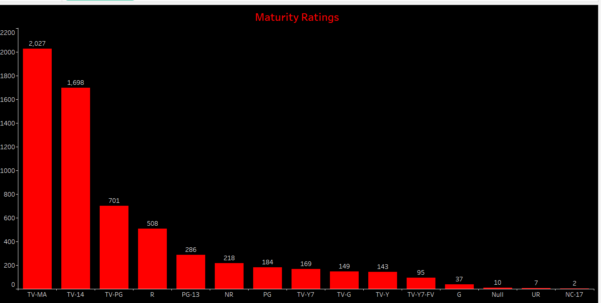
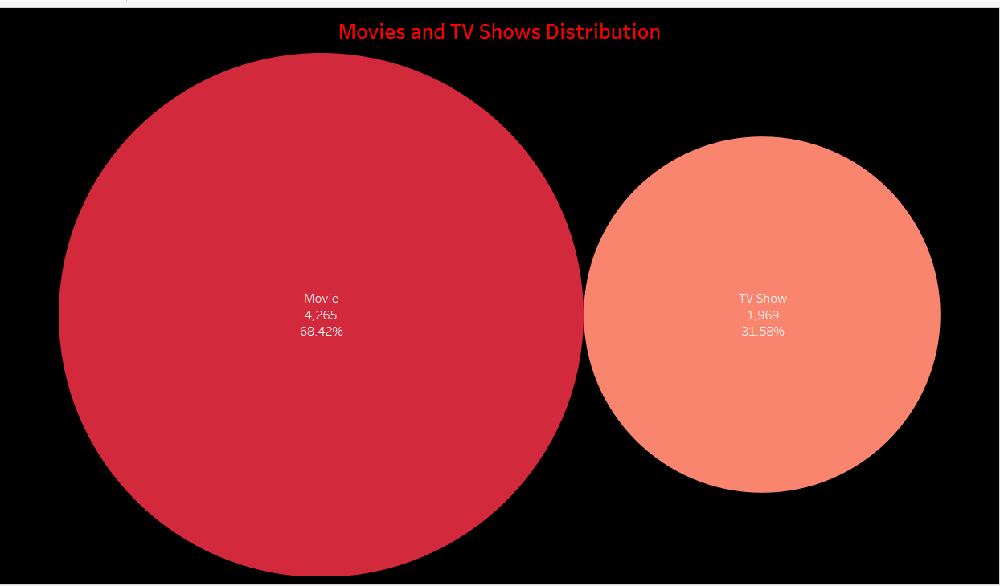
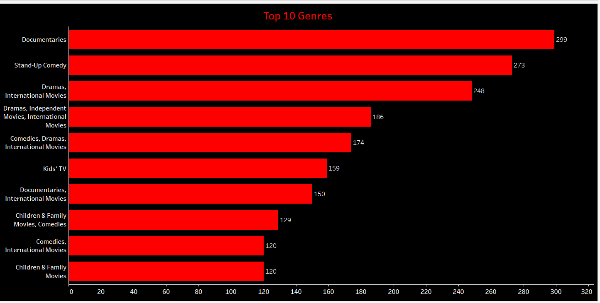
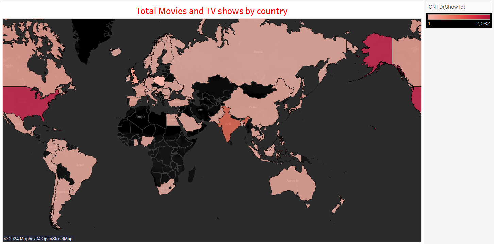
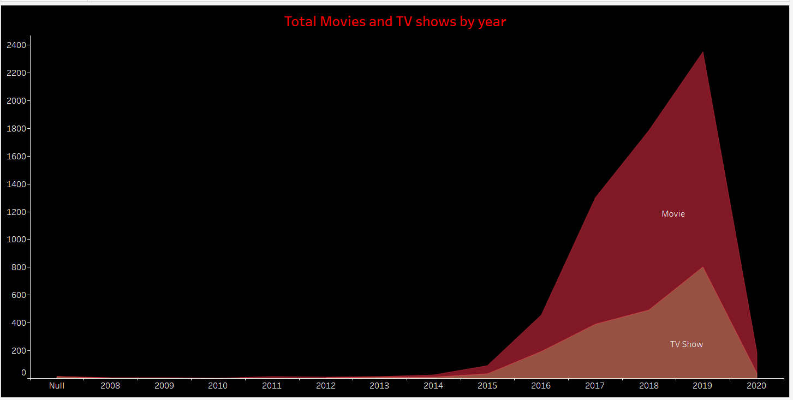

# 🎬 Dynamic Netflix Dashboard (Tableau)

This project showcases an interactive **Netflix Dashboard** developed using **Tableau**, designed to provide meaningful insights into Netflix’s extensive content library. The dashboard explores viewing trends across countries, genres, ratings, and content categories through engaging and interactive visualizations.

---

## 📂 Project Overview

The dashboard was built using a publicly available Netflix dataset, with data preprocessing and cleaning performed in **Microsoft Excel**. Tableau was then utilized to create a dynamic and user-friendly dashboard that enables users to analyze Netflix’s global content distribution, genre preferences, and audience classifications.

---

## 📊 Key Dashboard Features

### 🔹 Interactive Title Search

* Search and filter specific movies or TV shows.
* Instantly view details such as title description, release year, duration, and genre.

### 🔹 Global Content Distribution

* Interactive world map displaying Netflix content availability by country.
* Offers insight into regional content distribution and global reach.

### 🔹 Content Rating Analysis

* Bar chart visualization showing the spread of content across maturity ratings.
* Helps evaluate audience targeting and content suitability.

### 🔹 Movies vs TV Shows Comparison

* Bubble chart illustrating the proportion of movies and TV shows available on Netflix.
* Highlights the dominance of movie content within the platform.

### 🔹 Genre Trend Analysis

* Horizontal bar chart showcasing the **Top 10 most popular genres**.
* Combines genre categories to provide deeper content insights.

### 🔹 Yearly Content Growth Trends

* Area chart tracking content additions over time.
* Distinguishes between movies and TV shows to reveal growth patterns and release trends.

---

## 🧪 Data Preparation & Processing

* Cleaned and refined raw data using **Excel** (handling null values, genre formatting, and data normalization).
* Developed **calculated fields** in Tableau for advanced analysis and categorization.
* Implemented **interactive filters** for title, genre, and content type to enhance exploration.
* Applied **Mapbox integration** and color-based visual encodings for improved visual representation and usability.
  
---

## 📁 Files Included

- `Netflix analysis.twbx` — Tableau packaged workbook  
- `README.md` — This documentation file  
- `DASHBOARD1.png` & `DASHBOARD2.png` — Preview images of dashboards  
- `TOTAL MOVIES AND TV SHOWS BY COUNTRY.png`  
- `MATURITY RATINGS.png`  
- `MOVIES AND TV SHOWS DISTRIBUTION.png`  
- `TOP 10 GENRES.png`  
- `TOTAL MOVIES AND TV SHOWS BY YEAR.png`  
- `DIRECTORS WITH MOST CONTENT ON NETFLIX.png`  

---

## 🚀 How to View

1. Download the `.twbx` file.
2. Open it using [Tableau Public (Free)](https://public.tableau.com/s/download) or Tableau Desktop.
3. Interact with filters, maps, and charts for deeper insights.

---

## 📌 Key Tools Used

- **Tableau** (Maps, Filters, Calculated Fields, Charts)
- **Excel** (Data Cleaning and Preprocessing)

---

## 🔐 Data Privacy

> 🛡️ This dashboard is based on publicly available Netflix metadata. No personally sensitive or copyrighted video content is included.

---

## 📷 Dashboard Previews

### 🔸 Main Dashboards
  
  

### 🔸 Insights Visualizations
**Directors with Most Content on Netflix**  

**Maturity Ratings**  

**Movies and TV Shows Distribution**  

**Top 10 Genres**  

**Total Movies and TV Shows by Country**  

**Total Movies and TV Shows by Year**  

---

## ✍️ Author

**Aditya G**  
3rd Year CSE Student — Dayananda Sagar College of Engineering  
Email: adityagurumurthy1618@gmail.com

---
